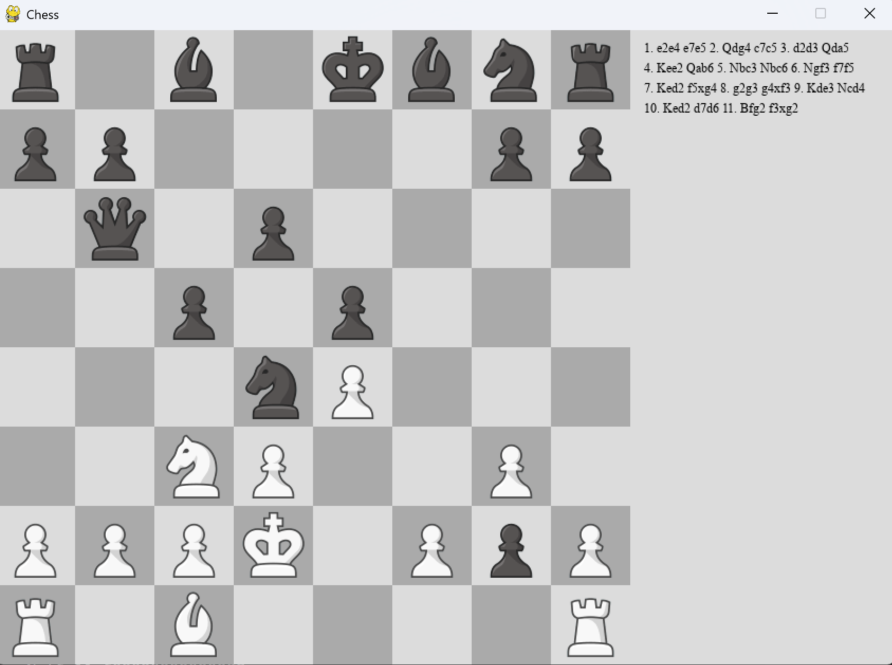

# ♟️ Powerful Chess Bot

A strategic chess game featuring an AI opponent powered by NegaMax + Alpha-Beta pruning. Includes full chess rules, a smooth GUI built with Pygame, and detailed analytics stored in MongoDB.

---

## 🧠 AI Algorithm — NegaMax + Alpha-Beta Pruning

The AI uses the NegaMax variant of the Minimax algorithm, enhanced with Alpha-Beta pruning to efficiently evaluate moves.

- Evaluates material score + positional value (piece-square tables)
- Supports pruning for faster decision-making
- Depth-based difficulty system: higher depth = stronger play

---

## 🔢 Bot Difficulty (Based on Depth)

| Difficulty | Depth | Description                     |
|------------|-------|---------------------------------|
| Easy       | 1     | Very fast, makes quick choices  |
| Medium     | 2     | Balanced performance and speed  |
| Hard       | 3+    | Strategic and more challenging  |

---

## ⚙️ Tech Stack

| Component     | Technology Used          |
|---------------|---------------------------|
| **Game Engine**   | Pygame                 |
| **AI Engine**     | NegaMax + Alpha-Beta   |
| **Database**      | MongoDB                |
| **Visualization** | Matplotlib             |
| **Language**      | Python 3.x             |

---


## Screenshots

### 🟢 Game Start


### 🤖 Running Bot


### 📊 Move Evaluation Terminal


### 📈 Moves Per Game


### ⏱️ Time Per Move


## 🛠️ Requirements

Install dependencies:
```bash
pip install pygame pymongo matplotlib
